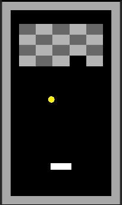
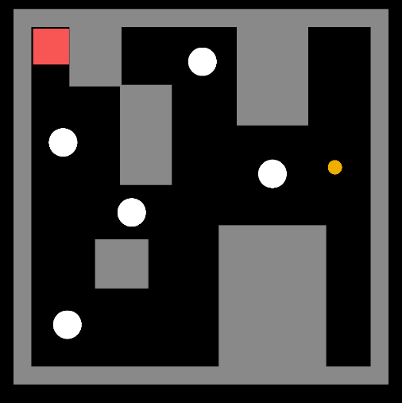

# Mini Game Collection (Unity)

Unity（C#）で制作したミニゲーム集です。  
個人学習およびポートフォリオ目的で作成しています。

## 収録ゲーム

### ■ ブロック崩し
- バー操作でボールを跳ね返し、ブロックを破壊するゲーム
- Physics2Dを使用
- リトライ・タイトル遷移あり
- **学習ポイント：衝突判定、状態管理、シーン遷移**

### ■ ビー玉迷路 (Marble Maze)
- 重力方向を操作してビー玉をゴールまで運ぶゲーム
- Physics2D.gravity を使用
- Hole / Goal 判定あり
- **学習ポイント：重力制御、Trigger判定、入力制御**

## 操作方法

### 共通
- WASD：操作
- UIボタン：リトライ / タイトルへ戻る

## 開発環境
- Unity：2022.3.62f1
- 言語：C#

## 備考
- ミニゲーム集として今後も作品を追加予定
- 現在脱出ゲーム（2Dアクション）を作成中

## スクリーンショット
### ブロック崩し

### ビー玉迷路

